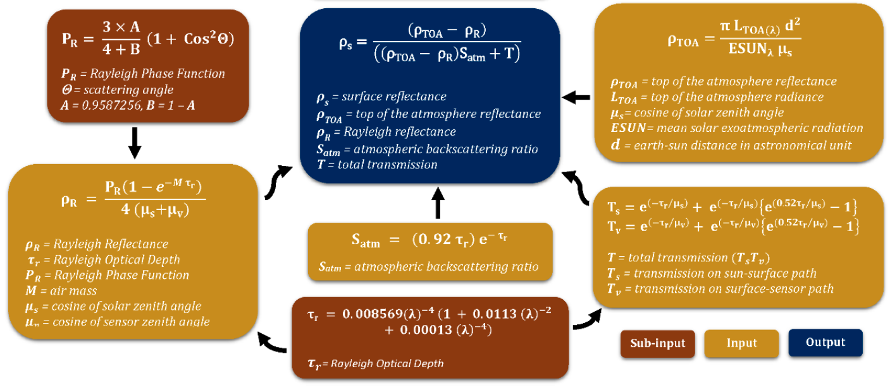

# SREM: A Simplified and Robust Surface Reflectance Estimation Method


SREM can be used for estimating surface reflectance of satellite imagery instead of other atmospheric correction algorithms. Core algorithm is based on "A Simplified and Robust Surface Reflectance Estimation Method (SREM) for Use over DiverseLand Surfaces Using Multi-Sensor Data" [[pdf](https://www.mdpi.com/2072-4292/11/11/1344/pdf)]. 


### Installation
Python >= 3.6 is required.
```bash
pip install git+https://github.com/oyam/srem
```

### Usage
```python
import numpy as np
from srem import srem

surface_reflectance = srem(
    toa_reflectance, # np.ndarray with shape of (height, width)
    wavelength, # float micrometer
    solar_azimuth_angle_deg, # float or np.ndarray with shape of (height, width)
    solar_zenith_angle_deg, # float or np.ndarray with shape of (height, width)
    sensor_azimuth_angle_deg, # float or np.ndarray with shape of (height, width)
    sensor_zenith_angle_deg # float or np.ndarray with shape of (height, width)
)

assert isinstance(surface_reflectance, np.ndarray)
assert surface_reflectance.shape == toa_reflectance.shape
```

Examples will be prepared for specific satellite imagery.

### Test
Installation for test environment
```bash
git clone && srem
pip install -e .\[test\]
```

Unit test
```bash
pytest
```

Lint
```bash
flake8 --config=.flake8
```

Type check
```bash
mypy --config-file mypy.ini ./srem/*.py
```

### References
- Bilal, Muhammad, et al. "A simplified and robust surface reflectance estimation method (srem) for use over diverse land surfaces using multi-sensor data." Remote Sensing 11.11 (2019): 1344.
